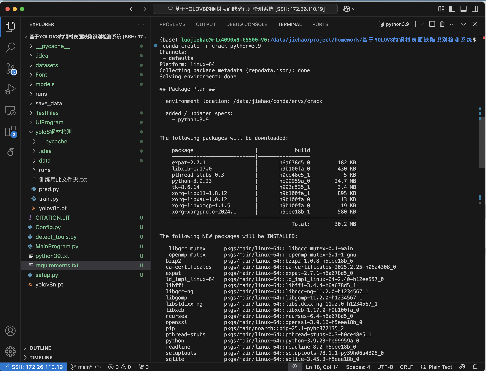
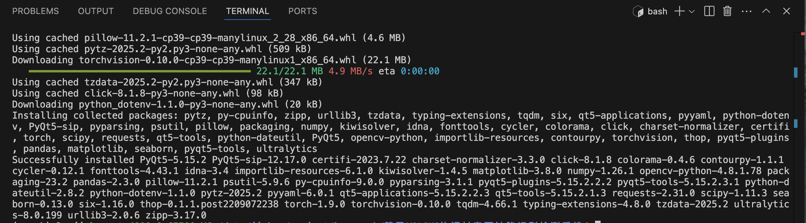
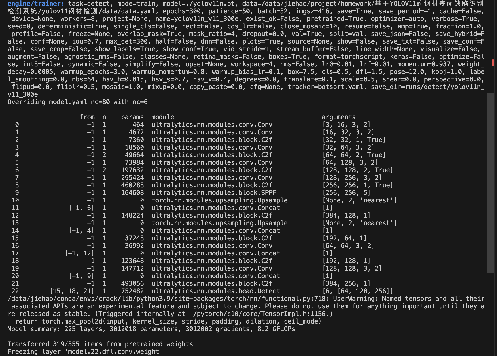
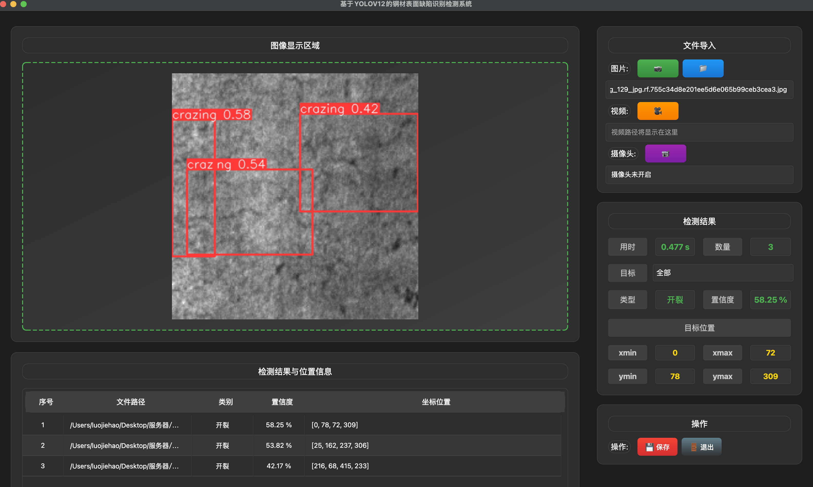

# Steel-defect-model-based-on-yolov12 🏭

## 项目简介 📋

本项目是**工业互联网第十组**的课程作业，基于YOLOv12算法实现钢材表面缺陷检测系统。项目旨在通过深度学习技术自动识别钢材表面的各种缺陷类型，包括开裂、氧化皮、划痕、斑块等。

**开发日期：** 2025年6月

## 功能特点 ✨

- 🔍 **多类别缺陷检测**：支持6种钢材表面缺陷类型识别
- 🚀 **高精度模型**：基于改进的YOLOv12算法，mAP@0.5达到96.7%
- 🎯 **实时检测**：支持图像和视频的实时缺陷检测
- 🖥️ **可视化界面**：提供友好的PyQt5图形用户界面
- ⚡ **工业应用**：适用于钢铁生产线质量检测场景

## 环境要求 🛠️

- Python 3.9
- PyTorch 1.9.0
- TorchVision 0.10.0
- CUDA (推荐，用于GPU加速)

## 安装步骤 📦

### 1. 创建虚拟环境

```bash
conda create -n yolo-defect python=3.9 -y
conda activate yolo-defect
```


### 2. 安装依赖包

```bash
pip install -r requirements.txt
```



> **⚠️ 重要提示：** 本项目使用 `torch==1.9.0` 和 `torchvision==0.10.0`，请确保版本一致以避免兼容性问题。

## 数据集说明 📊

项目已预置数据集，文件结构如下：

```
data/
├── train/     # 训练集
├── test/      # 测试集
└── valid/     # 验证集
```

数据集包含以下缺陷类型：
- 🔴 开裂 (Crazing)
- 🟡 内含杂质 (Inclusion)
- 🟢 斑块斑点 (Patches)
- 🔵 点蚀表面 (Pitted Surface)
- 🟠 轧制氧化皮 (Rolled-in Scale)
- 🟣 划痕 (Scratches)

## 使用方法 🚀

### 训练模型 🏃‍♂️

```bash
cd Steel-defect-model-based-on-yolov12/yolov12-Steel
python train.py
```

### 模型预测 🔮

```bash
cd Steel-defect-model-based-on-yolov12/yolov12-Steel
python pred.py
```




### 启动可视化界面 🖥️

```bash
python MainProgram.py
```



## 项目结构 📁

```
Steel-defect-model-based-on-yolov12/
├── data/                           # 数据集目录
│   ├── train/                     # 训练数据
│   ├── test/                      # 测试数据
│   └── valid/                     # 验证数据
│   └── ...
├── yolov12-Steel/                # 核心算法模块
│   ├── train.py                   # 训练脚本
│   └── pred.py                    # 预测脚本
│   └── ...
├── MainProgram.py                 # 主程序（UI界面）
├── requirements.txt               # 依赖包列表
└── README.md                      # 项目说明文档
└── train_log.md                   # 训练日志
└── ...
```

## 模型性能 📈

- **mAP@0.5:** 96.7%
- **推理速度:** 22ms/frame (GPU)
- **模型大小:** 轻量化设计，适合部署

## 技术特色 🔬

### 核心改进点

1. **多尺度特征提取** - 采用级联式特征提取架构
2. **混合注意力机制** - 集成通道注意力和空间注意力
3. **自适应损失函数** - 动态权重平衡的复合损失函数
4. **无锚框检测** - 摒弃传统预定义锚框机制

## 许可证 📄

本项目仅供学术研究和教育用途。

## 联系我们 📧

如有问题或建议，欢迎提出Issue或Pull Request！

---

**⭐ 如果这个项目对您有帮助，请给我们一个Star！**
